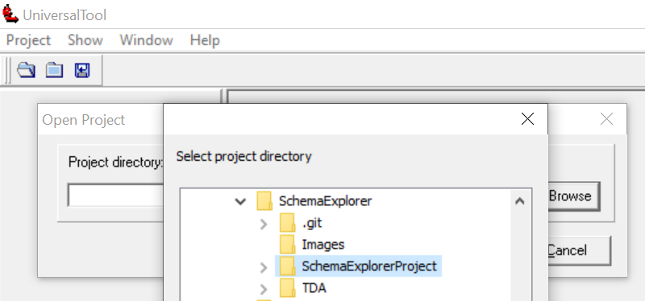
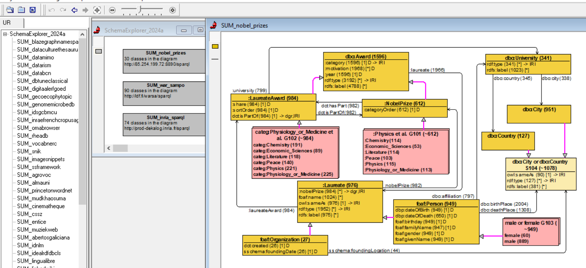
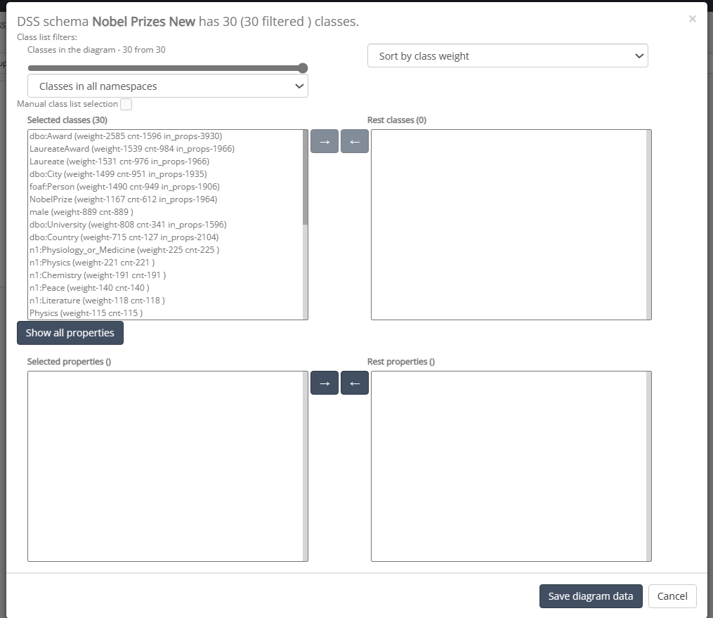

# DSS-schema-explorer

The `DSS Schema Explorer` allows you to get a visual representation of a [DSS](https://github.com/LUMII-Syslab/data-shape-server) schema.

## Acknowledgements

The **SchemaExplorer** module (as a project under the **TDA tool**) has been developed with support from Latvian Science Council project lzp-2021/1-0389 "Visual Queries in Distributed Knowledge Graphs" (since 2022).

The **TDA tool** has been developed at Institute of Mathematics and Computer Science, University of Latvia, https://lumii.lv.

## Installation

1. Perform `git clone`for this repository.
1. Start the `tda.exe` directly, or create a shortcut for it.
1. At the first start you may be asked (once or twice) for elevated rights as the tool needs to register an OCX component for graphical diagrams.
1. On some configurations, it might be necessary to run TDA with administrator privileges at the first start.
1. Open SchemaExplorer project (`./TDA/Projects/SchemaExplorer`). The project contains examples of DSS schema visualizations.

## Data preparation

1. Data preparation is done in the **ViziQuer** tool. See https://viziquer.lumii.lv for the tool description.
1. Export parameters are set in the EXTRA tab in the class tree of the diagram.
1. Data preparation time depends on the number of classes and properties, the results are two files `data.txt` and `data2.txt`.
1. These two files should be copied into the TDA project in the Schema Explorer (`./TDA/Projects/SchemaExplorer`), replacing existing files there.

## DSS schema visualization

1. To create a new DSS schema visualization, select `Diagram` tool from the Project Diagram's palette, then click on the diagram canvas where you want to place the diagram node. 
1. Afterwards a new window will open where you can edit the diagram name. 
1. Data input is performed with popup element - `FillDiagram`.
1. The created diagram can then be opened by double-clicking on the diagram node.

